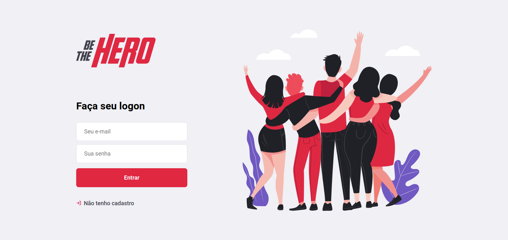

#  Be the Hero Project

A project where NGOs can register, then publish cases where the users can help financially. The technology used on this project is:
 
- NodeJs;
- ReactJS;
- React Native;
- ExpressJS;
- AxioJS;
- KnexJS;
- SQLite3;
- Expo;

 

The backend was build with NodeJS, using Express to handle the routes and KnexJS to handle the connection with the database. We used ReactJS to develop the frontend, using the Axios package to handle the routes and connect to the backend, and React Native to develop the mobile, building the app with Expo.

